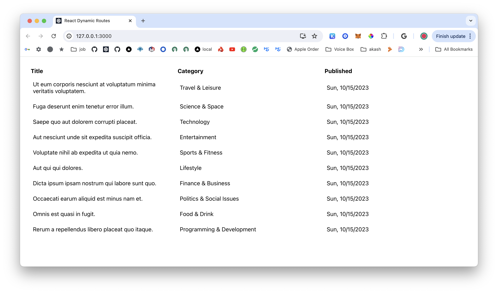

# Static Site Dynamic Routes

In this tutorial, you will learn how to configure your static site to use dynamic assembly routes built into blockless.

## Setup

Initialize a new static site.

```bash
bls sites init
```

Name your site.

```bash
my-site
```

Select React (Typescript) from the prompts.

```bash
? Pick a framework › - Use arrow-keys. Return to submit.
    Blank (Vite)
    React
❯   React (Typescript)
    Next.js
    Vue
```

## Install Dependencies

Install `react-router-dom` and `axios`.

```bash
npm install react-router-dom axios

- or - 

yarn add react-router-dom axios
```

## Define Types and Configure API

Create a file called `src/data-model/data-model-types.ts`.

```ts
// src/data-model/data-model-types.ts
export type PostType = {
  id: string;
  title: string;
  subtitle: string;
  category: string;
};

export type FetchError = {
  message: string;
  status?: number;
};

export type DataType = PostType[] | undefined;
```

Create the file `src/config.ts`.

```ts
// src/config.ts
interface Config {
  get: {
    allPostsApiUrl: string;
  };
}

const config: Config = {
  get: {
    allPostsApiUrl: `/api/test_multiple`,
  },
};

export default config;
```

## Build Hooks and Components

Create the custom hook `src/hooks/useFetchData.tsx`.

```tsx
// src/hooks/useFetchData.jsx
import { useState, useEffect } from 'react';
import axios from 'axios';
import { DataType, FetchError } from '../data-model/data-model-types';

const useFetchData = (url: string) => {
  const [data, setData] = useState<DataType[]>([]);
  const [loading, setLoading] = useState<boolean>(true);
  const [error, setError] = useState<FetchError | null>(null);

  useEffect(() => {
    const fetchData = async () => {
      try {
        const response = await axios.get<DataType[]>(url);
        setData(response.data);
      } catch (err: unknown) {
        if (axios.isAxiosError(err)) {
          // Axios specific error
          setError({
            message: err.message,
            status: err.response?.status,
          });
        } else if (err instanceof Error) {
          // General error
          setError({
            message: err.message,
          });
        } else {
          setError({
            message: 'An unknown error occurred',
          });
        }
      } finally {
        setLoading(false);
      }
    };

    fetchData();
  }, [url]);

  return { data, loading, error };
};

export default useFetchData;

```

Create the file `src/components/Table/index.tsx`

```tsx
// src/components/Table/index.tsx
import React from 'react';
import useFetchData from '../../hooks/useFetchData';
import config from '../../config';

const Table: React.FC = () => {
  const { data, loading, error } = useFetchData(`${config.get.allPostsApiUrl}`);

  if (loading) {
    return <div>'Loading...'</div>
  }

  if (!data || error) {
    return <div>Something went wrong. Please try again.</div>
  }

  return (
    <div>
      <table>
        <thead>
          <tr>
            <th>Title</th>
            <th>Category</th>
            <th>Published</th>
          </tr>
        </thead>
        <tbody>
          {data.map((item: any, i: number) => (
            <tr key={i}>
              <td>{item.title}</td>
              <td>{item.category}</td>
              <td>{item.created_at}</td>
            </tr>
          ))}
        </tbody>
      </table>
    </div>
  );
};

export default Table;
```

In the src/App.tsx file paste the following.

```tsx
// src/App.tsx
import React from 'react';
import { BrowserRouter as Router, Route, Routes } from 'react-router-dom';
import Table from './components/Table';

const App: React.FC = () => {
  return (
    <Router>
      <div className="App">
        <Routes>
          <Route path="/" element={<Table />} />
          <Route path="*" element={<div>Not Found</div>} />
        </Routes>
      </div>
    </Router>
  );
};

export default App;
```

## Dynamic Assembly Routes

Blockless has built in dynamic routes for easy API access.

Create a directory name `assembly` in the root of your application. Inside of that create another directory called `api` then inside of that folder create a file called `test_multiple.ts`.

    ├── assembly
    │   └── api
    │       └── test_multiple.ts
    └── src

Paste the following into `test_multiple.ts`.

```ts
import { http } from "@blockless/sdk/assembly";

export function GET(req: http.Request): http.Response {
const response = new http.Client().getList(
  "https://jsonfakery.com/blogs/random/10",
);

return new http.Response(response.stringify())
  .header("Content-Type", "application/json")
  .status(200);
}
```

This will fetch 10 random blog posts from `jsonfakery.com` using the config and custom hook we created above.

## Preview and Deploy

Verify that you are logged into Blockless.

```bash
bls login
```

Preview site on http://localhost:3000.

```bash
bls sites preview
```



Deploy application on Blockless.

```bash
bls sites deploy
```

Congratulations you have successfully deployed!!!

```bash
Publish successful!

Deploying react-dynamic-routes ...
Deployment successful!
Name:   react-dynamic-routes
URL:    https://react-dynamic-routes-41cce589.bls.dev
CID:    bafybeihhb3zogxsyik7i6aqhhgghilia57op
```
