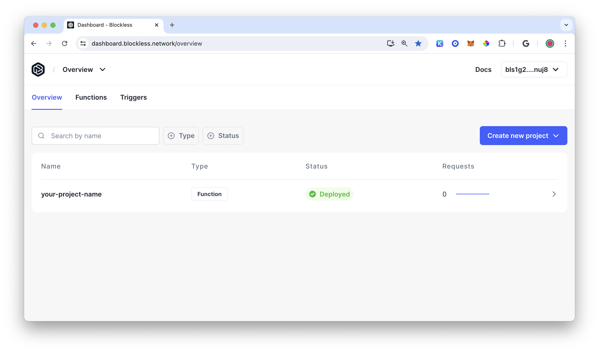
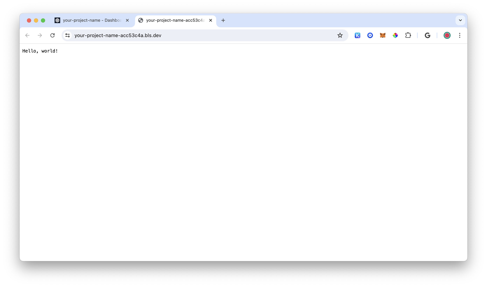

# Blockless Function Deploy Example

This is a simple application that when deployed will repeat back the string given.

## BLS Function Init

Create a new functional project and give it a name.

```bash
bls function init --name <your-project-name>
```

Select a framework and hit enter.

```bash
? Pick a framework › - Use arrow-keys. Return to submit.
❯   Assembly Script
    Rust
```

Pick a the hello world starter template.

```bash
? Pick a starter template › - Use arrow-keys. Return to submit.
❯   Hello World
    Price Oracle
```

Change directory to your project's directory.

```bash
cd your-project-name
```

## BLS Function Invoke

Test your project is working.

```bash
bls function invoke
```

You should see the following verification message in the console.

```bash
Build successful!

Hello, world!
```

## BLS Function Deploy

Deploy your function application to the Blockless Network.

```bash
bls function deploy
```

Navigate to https://dashboard.blockless.network/overview to  view your deployment.



Select your project.


Click on the `Invocation URL`.



Congratulations! You have successful deployed a project on the Blockless Network.