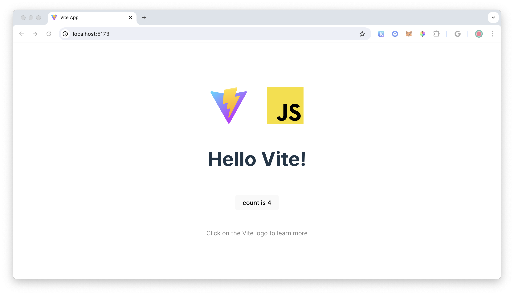
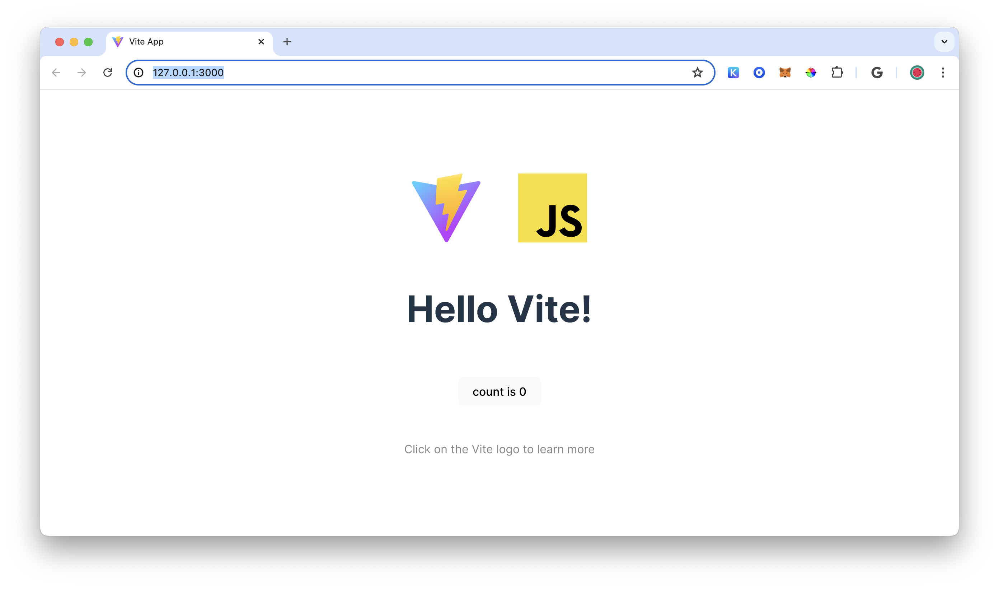

# Blockless Static Site Deploy Example

This is a simple application that will deploy a static Vite web application.

## BLS Sites

Initialize your static site.

```bash
bls sites init
```

Name your site.

```bash
? What would you like to name your site? › <your-site-name>
```

Select the Blank (Vite) framework.

```bash
? Pick a framework › - Use arrow-keys. Return to submit.
❯   Blank (Vite)
    React
    Next.js
    Vue
```

Change directory to `your-site-name`.

```bash
cd your-site-name
```

Install dependencies.

```bash
npm Install
```

Run project.

```bash
npm run dev
```

You will be prompted to navigate to a localhost address.

```bash
  VITE v5.3.3  ready in 344 ms

  ➜  Local:   http://localhost:5173/
  ➜  Network: use --host to expose
  ➜  press h + enter to show help
```



You can now develop this Vite site as you would any other site. Once you are ready to deploy move to the next section.

## BLS Sites Preview

Stop your development server by clicking on CTRL+C (macos).

Preview your project locally. This will create the build that will be deployed to the Blockless Network and preview it locally.

```bash
bls sites preview
```

You should see the following success message in the console:

```bash
Build successful!

Serving http://127.0.0.1:3000 ...
```

Navigate to http://127.0.0.1:3000 to view your project.



You are now ready to deploy!

## BLS Sites Deploy

Stop your development server by clicking on CTRL+C (macos).

Deploy your static site to the Blockless Network.

```bash
bls sites deploy
```

You should see the following success message in the console:

```bash
Deployment successful!
Name:   your-site-name
URL:    https://your-site-name-acc53c4a.bls.dev
CID:    bafybeib4fsqkqlup7nbuk7nhcvipue4y665rhxaeayzy63n62gkknqfjbq
```

Navigate to the URL shown in the console.


Congratulations! You have successful deployed a static web application on the Blockless Network.