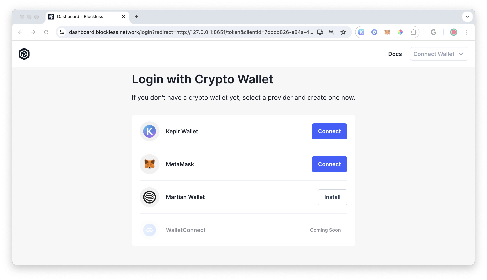

# Blockless Function Deploy Example

This is a simple application that when deployed will repeat back the string given.

## BLS Login

Login into the Blockless Network

```bash
bls login
```

You will be prompted to navigate to your localhost and connect your wallet.

```bash
Open Browser at http://0.0.0.0:8651 to complete login
-OR- Open Browser at http://127.0.0.1:8651 to complete login
```

Connect your preferred wallet.




You should see and verification message in your console.

```bash
Authentication Completed!
You have successfully authenticated with the server.
```

You can always check if you are logged in with the following command:

```bash
bls whoami
```


## BLS Function

Create a new functional project and give it a name.

```bash
bls function init --name <your-project-name>
```

Select a framework and hit enter.

```bash
? Pick a framework › - Use arrow-keys. Return to submit.
❯   Assembly Script
    Rust
```

Pick a the hello world starter template.

```bash
? Pick a starter template › - Use arrow-keys. Return to submit.
❯   Hello World
    Price Oracle
```

CD into your project's directory.

```bash
cd your-project-name
```

Test your project is working.

```bash
bls function invoke
```

You should see the following verification message in the console:

```bash
Build successful!

Hello, world!
```

## BLS Function Deploy

Deploy to the Blockless Network

```bash
bls function deploy
```

Navigate to https://dashboard.blockless.network/overview to  view your deployment.


Select your project.


Click on the `Invocation URL`.


Congratulations! You have successful deployed a project on the Blockless Network.