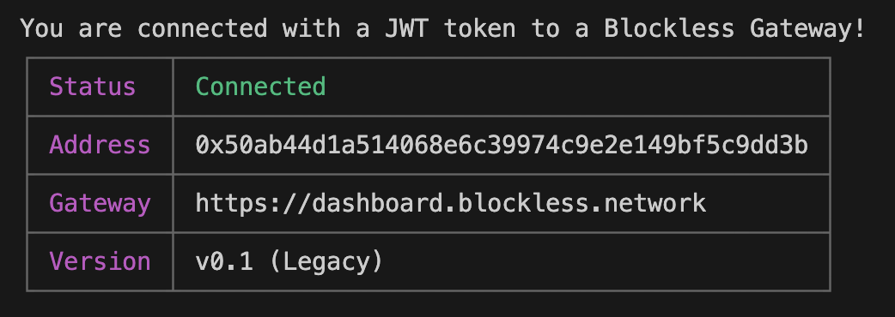

# Tutorials

Explore the Blockless Function and Static Site tutorials and get started on a sample project.

## Start a New Project with the Blockless CLI

First you will need to install the The Blockless Command Line Interface (CLI). This tool allows you to interact with the Blockless Network and manage your applications from the command line.

## Install the Blockless CLI

To install the Blockless CLI, you can either use `curl` or `wget`.

Installing Blockless CLI with `curl`:

```bash
sudo sh -c "curl https://raw.githubusercontent.com/BlocklessNetwork/cli/main/download.sh | bash"
```

Installing Blockless CLI with `wget`:

```bash
sudo sh -c "wget <https://raw.githubusercontent.com/BlocklessNetwork/cli/main/download.sh> -v -O download.sh; chmod +x download.sh; ./download.sh; rm -rf download.sh"
```

To install on Windows, go to the [releases page](https://github.com/blocklessnetwork/cli/releases) on GitHub and download the x86 version of the Blockless CLI.

## Get Familiar with Blockless CLI Commands

To see a list of available commands, you can run the `bls` or `bls help` command:

```bash
bls help
```

## Login into the Blockless Network

```bash
bls login
```

You will be prompted to navigate to your localhost and connect your wallet.

```bash
Open Browser at http://0.0.0.0:8651 to complete login
-OR- Open Browser at http://127.0.0.1:8651 to complete login
```

This will redirect you to the https://dashboard.blockless.network page where you can connect your preferred wallet.


You should see and verification message in your console.

```bash
Authentication Completed!
You have successfully authenticated with the server.
```

You can always check if you are logged in with the following command:

```bash
bls whoami
```



Proceed to the next tutorial to get started.